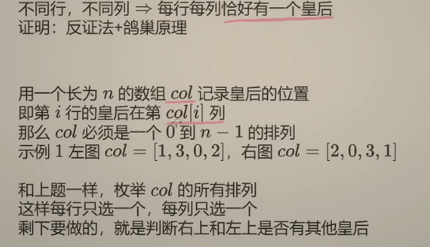
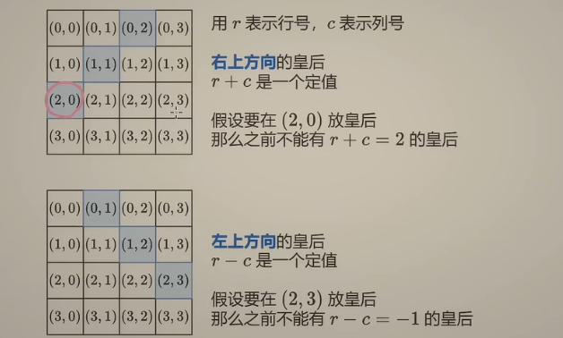
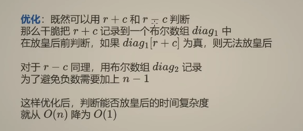
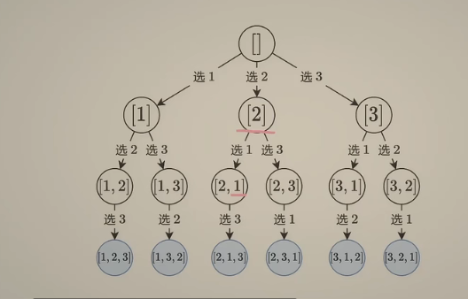
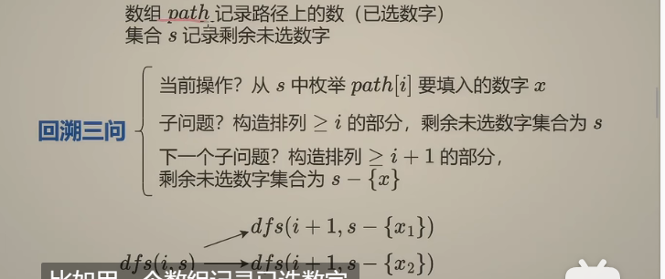

[51. N 皇后 - 力扣（Leetcode）](https://leetcode.cn/problems/n-queens/description/)







```python
class Solution:
    def solveNQueens(self, n: int) -> List[List[str]]:
        m = n * 2 - 1
        ans = []
        col = [0] * n
        on_path, diag1, diag2 = [False] * n, [False] * m, [False] * m
        def dfs(r: int) -> None:
            if r == n:
                ans.append(['.' * c + 'Q' + '.' * (n - 1 - c) for c in col])
                return
            for c, on in enumerate(on_path):
                if not on and not diag1[r + c] and not diag2[r - c]:
                    col[r] = c
                    on_path[c] = diag1[r + c] = diag2[r - c] = True
                    dfs(r + 1)
                    on_path[c] = diag1[r + c] = diag2[r - c] = False  # 恢复现场
        dfs(0)
        return ans
```

[46. 全排列 - 力扣（Leetcode）](https://leetcode.cn/problems/permutations/)






```python
class Solution:
    def permute(self, nums: List[int]) -> List[List[int]]:
        ans = []
        n = len(nums)
        path = [0] * n
        flag = [False] * n #标记每个数是否被选择
        def dfs(i:int)->None:
            if i == n:#递归结束点
                ans.append(path.copy())#防止递归修改ans
                return
            for j in range(n):
                if not flag[j]:
                    path[i] = nums[j]
                    flag[j] = True
                    dfs(i+1)
                    flag[j] = False#恢复现场，不恢复的话在选择2的时候就不能再次选择1
        dfs(0)
        return ans
```

