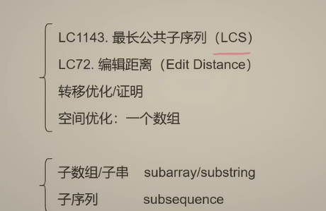
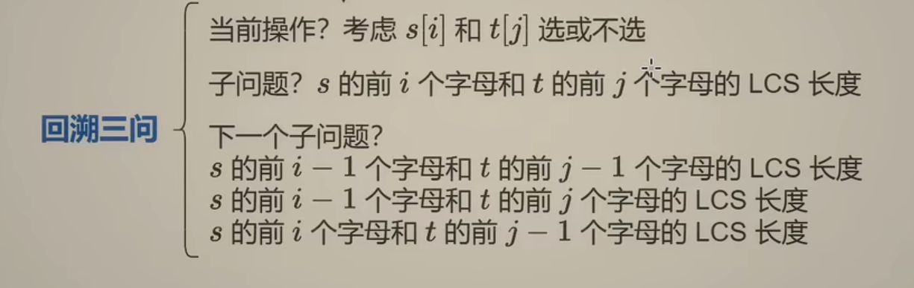
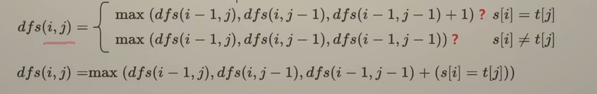

一般情况：子数组和子串是连续的

## **LCS问题**





证明：

当s[i] == t[j] 的时候，需要考虑只选其中一个的情况吗？

不需要

在s[i] != t[j] 的时候，需要考虑都不选的情况吗：？

不需要


```python
class Solution:
    def longestCommonSubsequence(self, s: str, t: str) -> int:
        n = len(s)
        m = len(t)
        #时间O(nm) == 空间
        @cache
        def dfs(i,j):
            if i < 0 or j < 0:
                return 0
            if s[i] == t[j]:
                return dfs(i-1,j-1) + 1
            return max(dfs(i-1,j),dfs(i,j-1))
        return dfs(n-1,m-1)
```

1：1 递推：

```python
class Solution:
    def longestCommonSubsequence(self, s: str, t: str) -> int:
        n = len(s)
        m = len(t)
        f = [[0] * (m+1) for _ in range(n+1)]
        for i ,x in enumerate(s):
            for j,y in enumerate(t):
                if x == y:
                    f[i+1][j+1] = f[i][j] + 1
                else:
                    f[i+1][j+1] = max(f[i][j+1],f[i+1][j])
        return f[n][m]
```

两个数组：滚动数组实现（%2技巧）

```python
class Solution:
    def longestCommonSubsequence(self, s: str, t: str) -> int:
        n, m = len(s), len(t)
        f = [[0] * (m + 1) for _ in range(2)]
        for i, x in enumerate(s):
            for j, y in enumerate(t):
                f[(i + 1) % 2][j + 1] = f[i % 2][j] + 1 if x == y else \
                                        max(f[i % 2][j + 1], f[(i + 1) % 2][j])
        return f[n % 2][m]
```

一个数组 ：

思路：

上一行：0 1 2 2 3 3

当前行：0 1 2 2 3 3

```
f[i][j] 的计算只与左上，左，上的值有关
```

```python
class Solution:
    def longestCommonSubsequence(self, s: str, t: str) -> int:
        f = [0] * (len(t) + 1)
        for x in s:
            pre = 0  # f[0]
            for j, y in enumerate(t):
                tmp = f[j + 1]
                f[j + 1] = pre + 1 if x == y else max(f[j + 1], f[j])
                pre = tmp
        return f[-1]
```

空间复杂度(O(m))


[72. 编辑距离 - 力扣（Leetcode）](https://leetcode.cn/problems/edit-distance/)

```python
class Solution:
    def minDistance(self, s: str, t: str) -> int:
        n = len(s)
        m = len(t)
        @cache
        def dfs(i,j):
            if i < 0:
                return j + 1 #操作步骤为将另一个字符串全部去掉
            if j < 0:
                return i + 1
            if s[i] == t[j]:
                return dfs(i-1,j-1)
            return min(dfs(i-1,j),dfs(i,j-1),dfs(i-1,j-1)) + 1
        return dfs(n-1,m-1)
```


```
class Solution:
    def minDistance(self, word1: str, word2: str) -> int:
        n = len(word1)
        m = len(word2)
        if n * m == 0:
            return n + m
        dp = [ [0] * (m + 1) for _ in range(n+1)]
        for i in range(n+1):
            dp[i][0] = i
        for j in range(m + 1):
            dp[0][j] = j
        for i in range(1,n+1):
            for j in range(1,m+1):
                if word1[i-1] != word2[j-1]:
                    dp[i][j] = 1 + min(dp[i][j-1],dp[i-1][j],dp[i-1][j-1])
                else:
                    dp[i][j] = 1 + min(dp[i][j-1],dp[i-1][j],dp[i-1][j-1] - 1)
        return dp[n][m]
```

