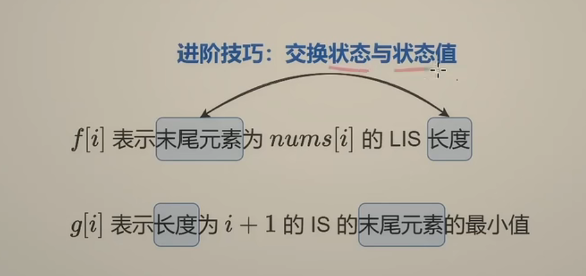
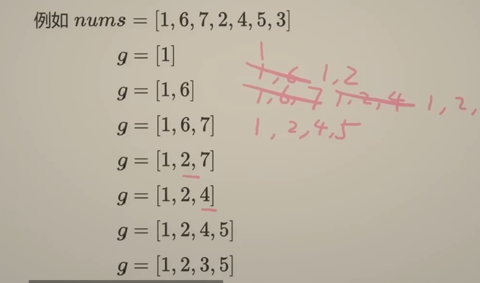

# 最长递增子序列

[300. 最长递增子序列 - 力扣（Leetcode）](https://leetcode.cn/problems/longest-increasing-subsequence/)

> 给你一个整数数组 `nums` ，找到其中最长严格递增子序列的长度。
>
> **子序列** 是由数组派生而来的序列，删除（或不删除）数组中的元素而不改变其余元素的顺序。例如，`[3,6,2,7]` 是数组 `[0,3,1,6,2,2,7]` 的子序列。
>
> ```
> 输入：nums = [10,9,2,5,3,7,101,18]
> 输出：4
> 解释：最长递增子序列是 [2,3,7,101]，因此长度为 4 。
> ```

时间复杂度:O(n*2)

空间复杂度:O(n)

```python
class Solution:
    def lengthOfLIS(self, nums: List[int]) -> int:
        n = len(nums)
        dp = [0] * n
        for i in range(n):
            dp[i] = 1
            for j in range(i):
                if nums[j] < nums[i]:
                    dp[i] = max(dp[i],dp[j]+1)
        return max(dp)
```

优化时间复杂度：贪心 + 二分





```python
class Solution:
    def lengthOfLIS(self, nums: List[int]) -> int:
        n = len(nums)
        g = []
        for x in nums:
            j = bisect_left(g,x)
            if j == len(g):
                g.append(x)
            else:
                g[j] = x
        return len(g)
```

时间复杂度:O(n*logn)

> bisect.bisect和bisect.bisect_right返回大于x的第一个下标(相当于C++中的upper_bound)，bisect.bisect_left返回大于等于x的第一个下标(相当于C++中的lower_bound)。