# 状态机DP

## 1.买卖股票系列：

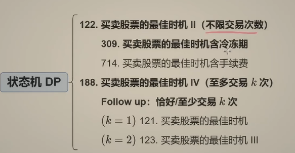

[122. 买卖股票的最佳时机 II - 力扣（Leetcode）](https://leetcode.cn/problems/best-time-to-buy-and-sell-stock-ii/)

> 给你一个整数数组 `prices` ，其中 `prices[i]` 表示某支股票第 `i` 天的价格。
>
> 在每一天，你可以决定是否购买和/或出售股票。你在任何时候 **最多** 只能持有 **一股** 股票。你也可以先购买，然后在 **同一天** 出售。
>
> 返回 *你能获得的 **最大** 利润* 。

```
输入：prices = [7,1,5,3,6,4]
输出：7
解释：在第 2 天（股票价格 = 1）的时候买入，在第 3 天（股票价格 = 5）的时候卖出, 这笔交易所能获得利润 = 5 - 1 = 4 。
     随后，在第 4 天（股票价格 = 3）的时候买入，在第 5 天（股票价格 = 6）的时候卖出, 这笔交易所能获得利润 = 6 - 3 = 3 。
     总利润为 4 + 3 = 7 。
```

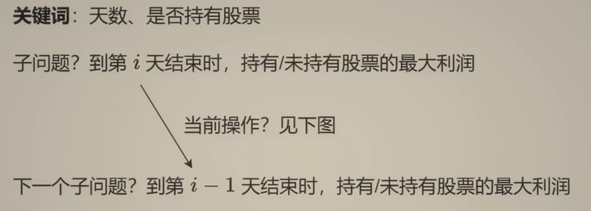

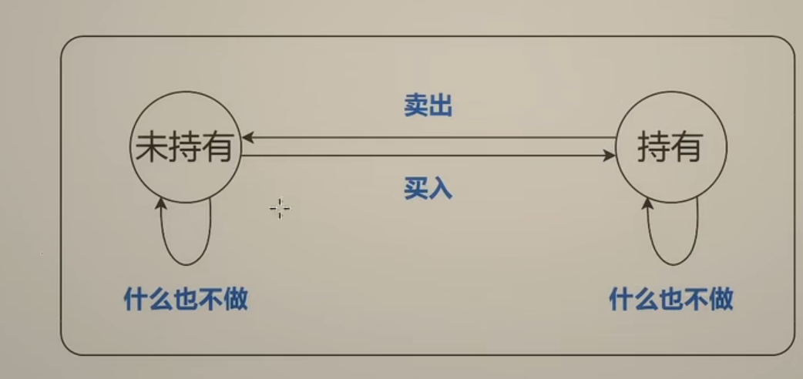

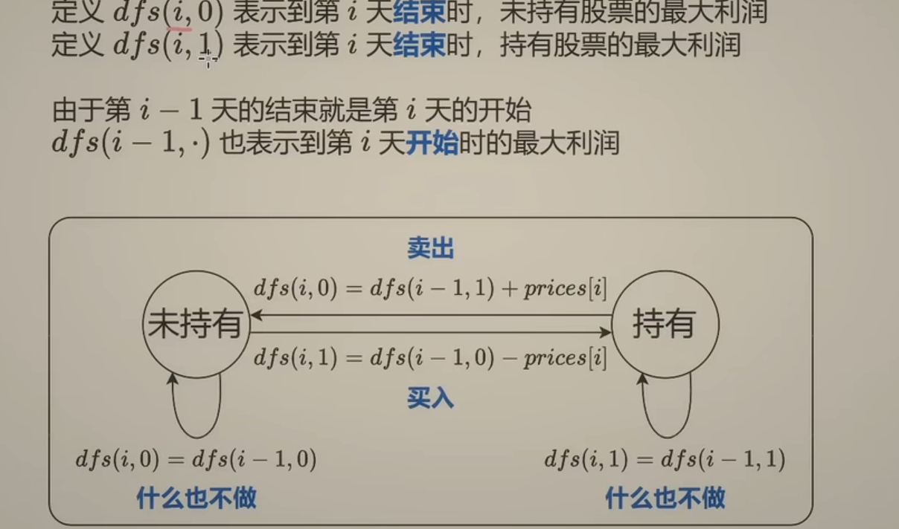

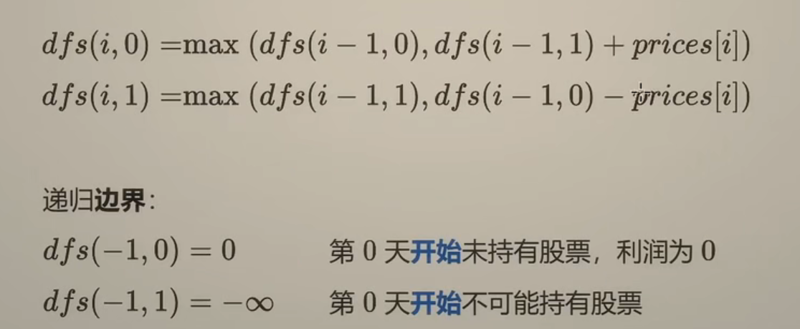

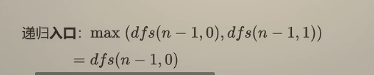

```python
class Solution:
    def maxProfit(self, prices: List[int]) -> int:
        n = len(prices)
        
        @cache
        def dfs(i,hold):
            if i < 0:
                return -inf if hold else 0
            if hold:#从未持有股票状态变成持有状态--> 要不什么也不做，要不买入股票
                return max(dfs(i-1,True),dfs(i-1,False) - prices[i])
            return max(dfs(i-1,False),dfs(i-1,True) + prices[i])
        return dfs(n-1,False)
```

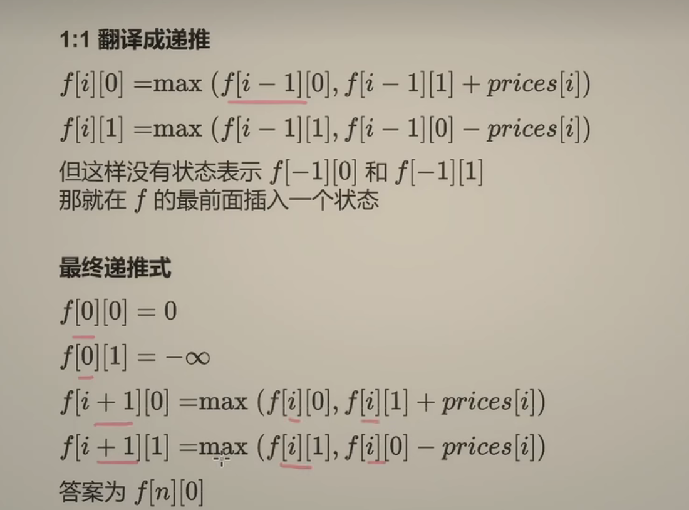

```python
class Solution:
    def maxProfit(self, prices: List[int]) -> int:
        n = len(prices)
        f = [[0] * 2 for _ in range(n + 1)]
        f[0][1] = -inf
        for i, p in enumerate(prices):
            f[i + 1][0] = max(f[i][0], f[i][1] + p)
            f[i + 1][1] = max(f[i][1], f[i][0] - p)
        return f[n][0]

```

以上时空复杂度均为O(n)

优化：

空间O(1):

```python
class Solution:
    def maxProfit(self, prices: List[int]) -> int:
        f0, f1 = 0, -inf
        for p in prices:
            f0, f1 = max(f0, f1 + p), max(f1, f0 - p)
        return f0
```

[309. 最佳买卖股票时机含冷冻期 - 力扣（Leetcode）](https://leetcode.cn/problems/best-time-to-buy-and-sell-stock-with-cooldown/description/)

> 给定一个整数数组`prices`，其中第 `prices[i]` 表示第 `*i*` 天的股票价格 。
>
> 设计一个算法计算出最大利润。在满足以下约束条件下，你可以尽可能地完成更多的交易（多次买卖一支股票）:
>
> - 卖出股票后，你无法在第二天买入股票 (即冷冻期为 1 天)。
>
> **注意：**你不能同时参与多笔交易（你必须在再次购买前出售掉之前的股票）。

比如在第i天卖出股票，则无法再第i天买入股票，因此状态从i-2迁移过来

```python
class Solution:
    def maxProfit(self, prices: List[int]) -> int:
        n = len(prices)
        @cache
        def dfs(i,hold):
            if i < 0:
                return -inf if hold else 0
            if hold:#从未持有股票状态变成持有状态--> 要不什么也不做，要不买入股票
                return max(dfs(i-1,True),dfs(i-2,False) - prices[i])
            return max(dfs(i-1,False),dfs(i-1,True) + prices[i])
        return dfs(n-1,False)
    
class Solution:
    def maxProfit(self, prices: List[int]) -> int:
        n = len(prices)
        f = [[0] * 2 for _ in range(n + 1)]
        f[0][1] = -inf
        for i, p in enumerate(prices):
            f[i + 1][0] = max(f[i][0], f[i][1] + p)
            f[i + 1][1] = max(f[i][1], f[i-1][0] - p)
        return f[n][0]
    
class Solution:
    def maxProfit(self, prices: List[int]) -> int:
        pre0,f0,f1 = 0,0,-inf
        for p in prices:
            pre0 ,f0,f1 = f0,max(f0,f1+p),max(f1,pre0-p)
        return f0
```


[188. 买卖股票的最佳时机 IV - 力扣（Leetcode）](https://leetcode.cn/problems/best-time-to-buy-and-sell-stock-iv/)

> 给定一个整数数组 `prices` ，它的第 `i` 个元素 `prices[i]` 是一支给定的股票在第 `i` 天的价格，和一个整型 `k` 。
>
> 设计一个算法来计算你所能获取的最大利润。你最多可以完成 `k` 笔交易。也就是说，你最多可以买 `k` 次，卖 `k` 次。
>
> **注意：**你不能同时参与多笔交易（你必须在再次购买前出售掉之前的股票）。
>
> ```
> 输入：k = 2, prices = [2,4,1]
> 输出：2
> 解释：在第 1 天 (股票价格 = 2) 的时候买入，在第 2 天 (股票价格 = 4) 的时候卖出，这笔交易所能获得利润 = 4-2 = 2 。
> ```
>
>  
>
> ```
> 输入：k = 2, prices = [3,2,6,5,0,3]
> 输出：7
> 解释：在第 2 天 (股票价格 = 2) 的时候买入，在第 3 天 (股票价格 = 6) 的时候卖出, 这笔交易所能获得利润 = 6-2 = 4 。
>      随后，在第 5 天 (股票价格 = 0) 的时候买入，在第 6 天 (股票价格 = 3) 的时候卖出, 这笔交易所能获得利润 = 3-0 = 3 。
> ```

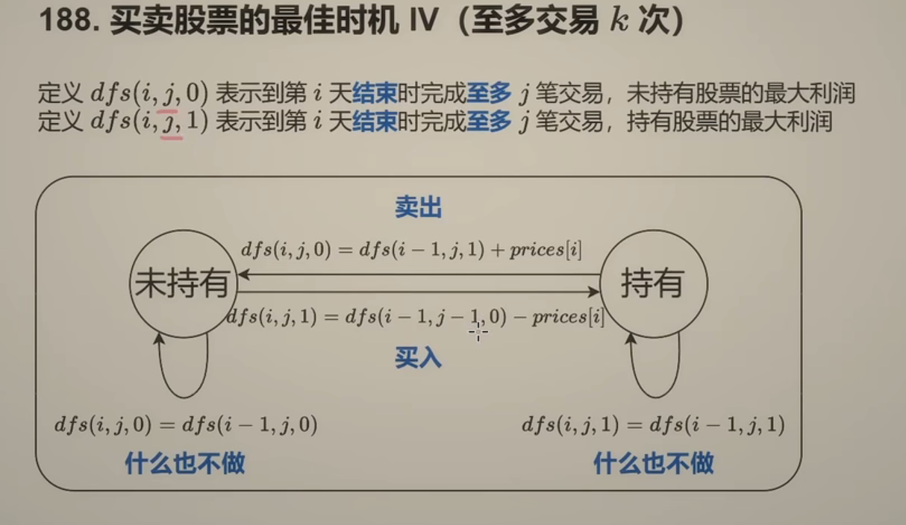

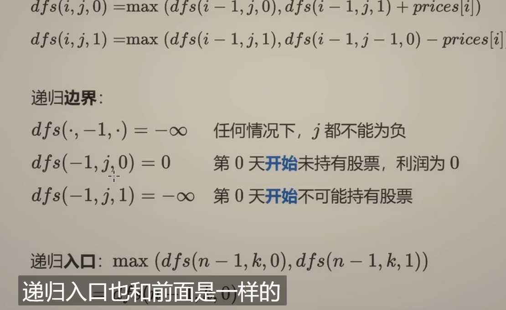

```python
class Solution:
    def maxProfit(self, k: int, prices: List[int]) -> int:
        n = len(prices)
        @cache
        def dfs(i,j,hold):
            if j < 0:
                return -inf
            if i < 0:
                return -inf if hold else 0
            if hold:
                return max(dfs(i-1,j,True),dfs(i-1,j-1,False) - prices[i])  
            return max(dfs(i-1,j,False),dfs(i-1,j,True) + prices[i])  #j-1也可以写在这里
        return dfs(n-1,k,False)
```

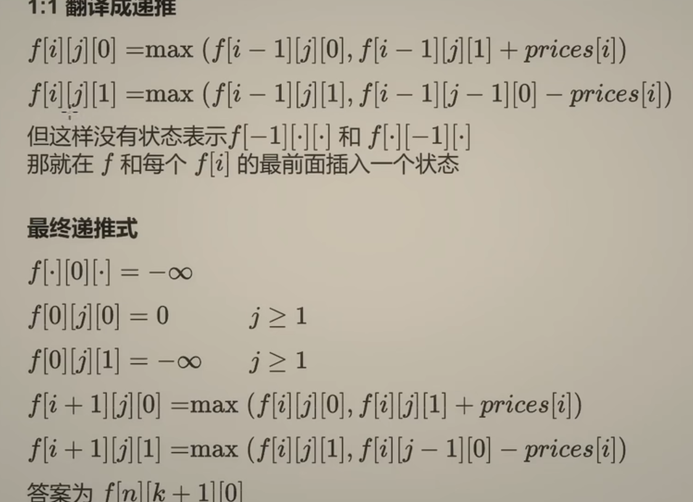

```python
class Solution:
    def maxProfit(self, k: int, prices: List[int]) -> int:
        n = len(prices)
        f = [[[-inf] * 2 for _ in range(k + 2)] for _ in range(n + 1)]
        for j in range(1, k + 2):
            f[0][j][0] = 0
        for i, p in enumerate(prices):
            for j in range(1, k + 2):
                f[i + 1][j][0] = max(f[i][j][0], f[i][j][1] + p)
                f[i + 1][j][1] = max(f[i][j][1], f[i][j - 1][0] - p)
        return f[-1][-1][0]
```

```python
class Solution:
    def maxProfit(self, k: int, prices: List[int]) -> int:
        f = [[-inf] * 2 for _ in range(k + 2)]
        for j in range(1, k + 2):
            f[j][0] = 0
        for i, p in enumerate(prices):
            for j in range(k + 1, 0, -1):  # 原理见 0-1 背包那期视频
                f[j][0] = max(f[j][0], f[j][1] + p)
                f[j][1] = max(f[j][1], f[j - 1][0] - p)
        return f[-1][0]
```

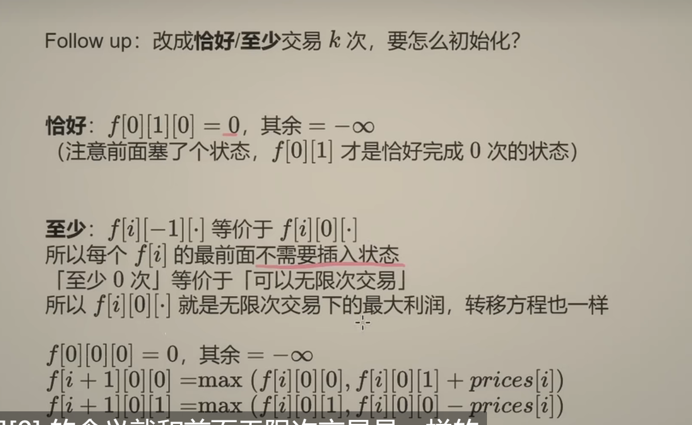

> 如果改成「恰好」完成 k 笔交易要怎么做？
>
> 递归到 i<0 时，只有 j=0 才是合法的，j>0  是不合法的。

```python
# 恰好
class Solution:
    def maxProfit(self, k: int, prices: List[int]) -> int:
        # 递推
        n = len(prices)
        f = [[[-inf] * 2 for _ in range(k + 2)] for _ in range(n + 1)]
        f[0][1][0] = 0  # 只需改这里
        for i, p in enumerate(prices):
            for j in range(1, k + 2):
                f[i + 1][j][0] = max(f[i][j][0], f[i][j][1] + p)
                f[i + 1][j][1] = max(f[i][j][1], f[i][j - 1][0] - p)
        return f[-1][-1][0]

        # 记忆化搜索
        # @cache
        # def dfs(i: int, j: int, hold: bool) -> int:
        #     if j < 0:
        #         return -inf
        #     if i < 0:
        #         return -inf if hold or j > 0 else 0
        #     if hold:
        #         return max(dfs(i - 1, j, True), dfs(i - 1, j - 1, False) - prices[i])
        #     return max(dfs(i - 1, j, False), dfs(i - 1, j, True) + prices[i])
        # return dfs(n - 1, k, False)

```

> 如果改成「至少」完成 k 笔交易要怎么做？
>
> 递归到「至少 0 次」时，它等价于「交易次数没有限制」，

```python
# 至少
class Solution:
    def maxProfit(self, k: int, prices: List[int]) -> int:
        # 递推
        n = len(prices)
        f = [[[-inf] * 2 for _ in range(k + 1)] for _ in range(n + 1)]
        f[0][0][0] = 0
        for i, p in enumerate(prices):
            f[i + 1][0][0] = max(f[i][0][0], f[i][0][1] + p)
            f[i + 1][0][1] = max(f[i][0][1], f[i][0][0] - p)  # 无限次
            for j in range(1, k + 1):
                f[i + 1][j][0] = max(f[i][j][0], f[i][j][1] + p)
                f[i + 1][j][1] = max(f[i][j][1], f[i][j - 1][0] - p)
        return f[-1][-1][0]

        # 记忆化搜索
        # @cache
        # def dfs(i: int, j: int, hold: bool) -> int:
        #     if i < 0:
        #         return -inf if hold or j > 0 else 0
        #     if hold:
        #         return max(dfs(i - 1, j, True), dfs(i - 1, j - 1, False) - prices[i])
        #     return max(dfs(i - 1, j, False), dfs(i - 1, j, True) + prices[i])
        # return dfs(n - 1, k, False)
```

