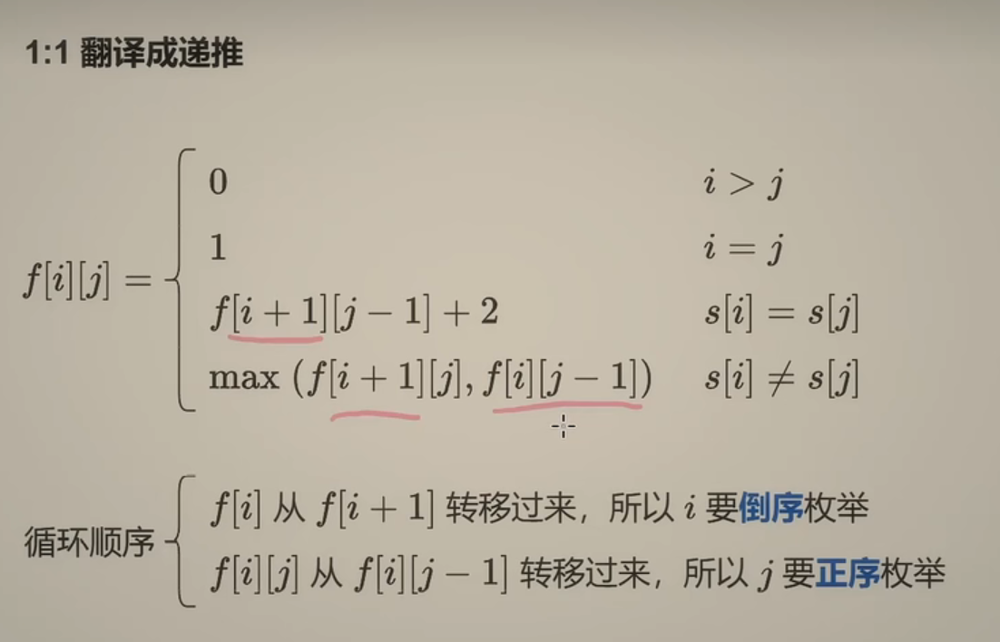

# 最长回文子序列

[516. 最长回文子序列 - 力扣（Leetcode）](https://leetcode.cn/problems/longest-palindromic-subsequence/description/)

```python
class Solution:
    def longestPalindromeSubseq(self, s: str) -> int:
        n = len(s)
        @cache
        def dfs(i,j):
            if i > j: #空串
                return 0
            if i == j:# 只有一个字母
                return 1
            if s[i] == s[j]:#都选
                return dfs(i+1,j-1) + 2
            return max(dfs(i+1,j),dfs(i,j-1))
        return dfs(0,n-1)
```



```python
class Solution:
    def longestPalindromeSubseq(self, s: str) -> int:
        n = len(s)
        f = [[0] * n for _ in range(n)]
        for i in range(n-1,-1,-1):
            f[i][i] = 1
            for j in range(i+1,n):
                if s[i] == s[j]:
                    f[i][j] = f[i+1][j-1] + 2
                else:
                    f[i][j] = max(f[i+1][j],f[i][j-1])
        return f[0][n-1]
            
```

