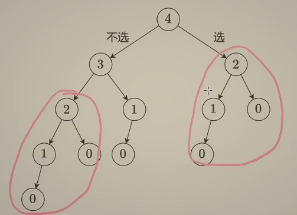
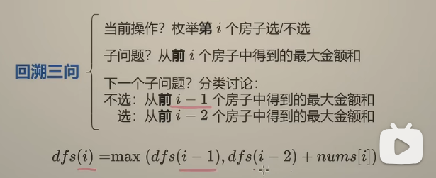
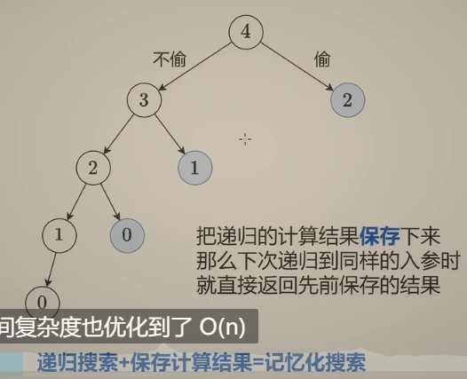
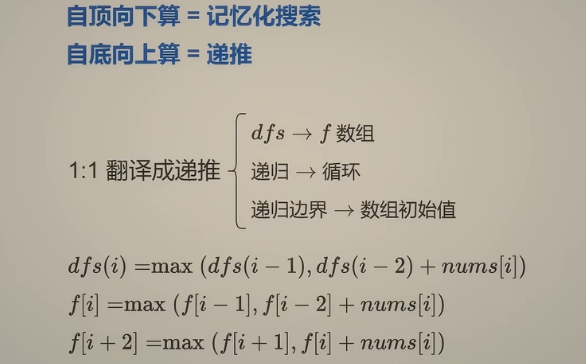

# 动态规划：

1.思考回溯怎么写：入参和返回值，递归到哪里，递归边界和入口

2.改成记忆化搜索

3.1:1翻译成递推

leetcode：198

[198. 打家劫舍 - 力扣（Leetcode）](https://leetcode.cn/problems/house-robber/)








```python
class Solution:
    def rob(self, nums: List[int]) -> int:
        #递归+记忆化搜索
        n = len(nums)
        cache = [-1] * n
        def dfs(i):
            if i < 0:
                return 0
            if cache[i] != -1:
                return cache[i]
            res = max(dfs(i-1),dfs(i-2) + nums[i])
            cache[i] = res
            return res
        return dfs(n-1)
```



```python
class Solution:
    def rob(self, nums: List[int]) -> int:
        n =  len(nums)
        f = [0] * (n+2)
        for i,x in enumerate(nums):
            f[i+2] = max(f[i+1],f[i] + x)
        return f[n+1]
```

可以改成滚动数组形式进行空间优化达到O(1):

```python
class Solution:
    def rob(self, nums: List[int]) -> int:
        n =  len(nums)
        f0 = f1 = 0
        for i,x in enumerate(nums):
            new_f = max(f1,f0 + x)
            f0 = f1
            f1 = new_f
        return f1
```

