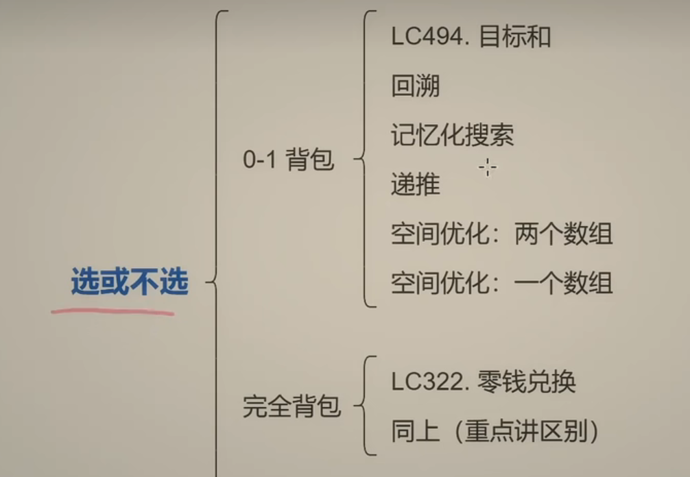
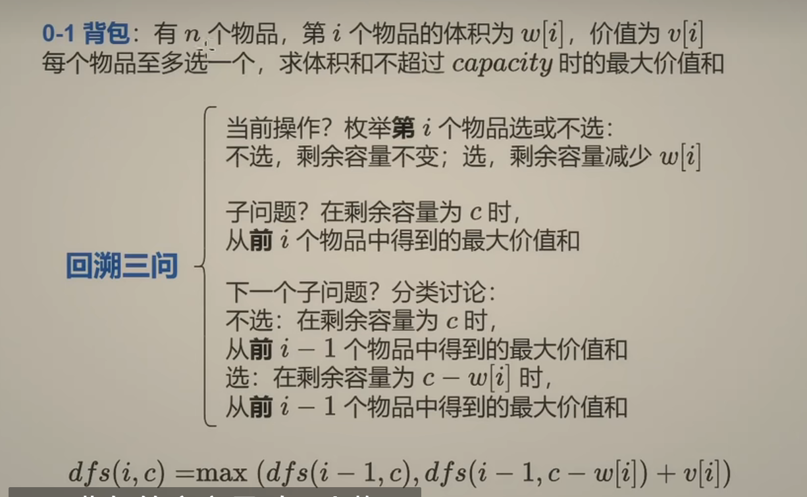
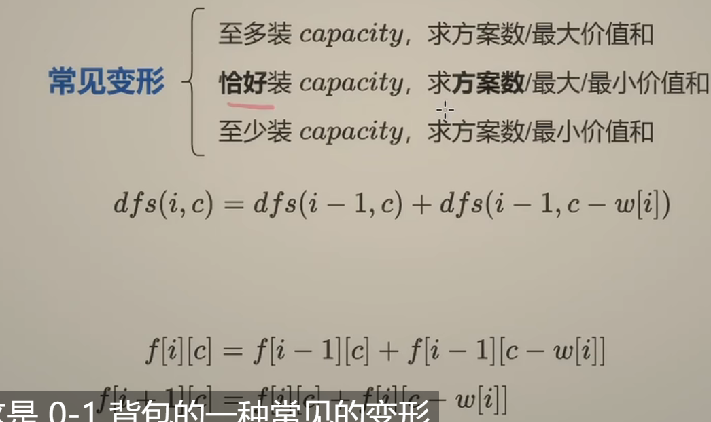
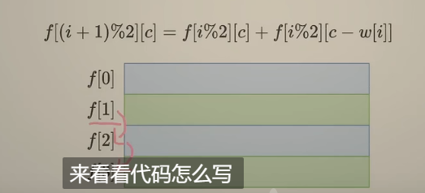
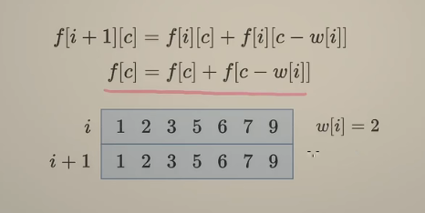
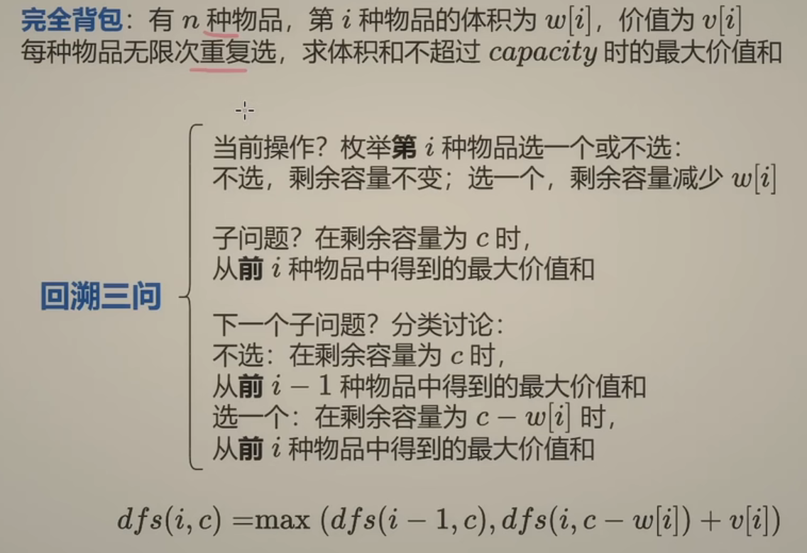
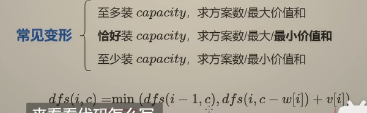

# 动态规划之01背包-完全背包






```python
def zero_one_knaspack(capacity:int,w:List[int],v:List[int]) ->int:
    n = len(w)
    @cache
    def dfs(i,c):
        if i < 0:
            return 0
        if c < w[i]:
            return dfs(i-1,c)
        return max(dfs(i-1,c),dfs(i-1,c-w[i]) + v[i])
    return dfs(n-1,capacity)

```



[494. 目标和 - 力扣（Leetcode）](https://leetcode.cn/problems/target-sum/)

> 假设添加正号的数和为p:
>
> 则添加负数的和为所有数的和减去p：s-p
>
> 所以：p-(s-p) == target(题目中的)
>
> 2p = s+t
>
> p = (s+t) /2
>
> 所以原题目变成从nums中选择一些数，是其和正好等于(s+t) /2 的方案数   即常见变形中的第二个
>
> dfs(i,c) 表示从前i个数中选择一些数恰好组成c 的方案数

```python
class Solution:
    def findTargetSumWays(self, nums: List[int], target: int) -> int:
        target += sum(nums)  # 相当于s+t
        if target < 0 or target % 2:
            return 0
        target //= 2  #即p

        @cache  # 记忆化搜索
        def dfs(i, c):
            if i < 0:
                return 1 if c == 0 else 0
            if c < nums[i]:
                return dfs(i - 1, c)
            return dfs(i - 1, c) + dfs(i - 1, c - nums[i])
        return dfs(len(nums) - 1, target)
```

1：1 翻译成递推：

```python
class Solution:
    def findTargetSumWays(self, nums: List[int], target: int) -> int:
        target += sum(nums)
        if target < 0 or target % 2:
            return 0
        target //= 2
        
        n = len(nums)
        f = [[0] * (target+1) for _ in range(n+1)]
        f[0][0] = 1
        for i,x in enumerate(nums):
            for c in range(target+1):
                if c < x:
                    f[i+1][c] = f[i][c]
                else:
                    f[i+1][c] = f[i][c] + f[i][c-x]
        return f[n][target]
```

时空复杂度：O(n * (target+s))，n是nums长度，s为nums元素和；


空间优化1：

由于每次计算只用到两个数组，计算f[i] 的时候，只用到了f[i-1] ,所以可以把结果保存到f[i-2]中



```python
class Solution:
    def findTargetSumWays(self, nums: List[int], target: int) -> int:
        target += sum(nums)
        if target < 0 or target % 2:
            return 0
        target //= 2

        n = len(nums)
        f = [[0] * (target + 1) for _ in range(2)]
        f[0][0] = 1
        for i, x in enumerate(nums):
            for c in range(target + 1):
                if c < x:
                    f[(i + 1) % 2][c] = f[i % 2][c]
                else:
                    f[(i + 1) % 2][c] = f[i % 2][c] + f[i % 2][c - x]
        return f[n % 2][target]
```

**空间复杂度:O(target+S)**

优化2：




倒着计算不会覆盖：空间优化一个数组

```python
class Solution:
    def findTargetSumWays(self, nums: List[int], target: int) -> int:
        target += sum(nums)
        if target < 0 or target % 2:
            return 0
        target //= 2
        f = [1] + [0] * target
        for x in nums:
            for c in range(target, x - 1, -1):
                f[c] += f[c - x]
        return f[target]
```




完全背包，和01区别在于每种物品可以无限次选择；回溯时候将i-1改成i



[322. 零钱兑换 - 力扣（Leetcode）](https://leetcode.cn/problems/coin-change/)

#### 递归搜索 + 保存计算结果 = 记忆化搜索

```python
class Solution:
    def coinChange(self, coins: List[int], amount: int) -> int:
        @cache
        def dfs(i,c):
            if i < 0:
                return 0 if c == 0 else inf
            if c < coins[i]:
                return dfs(i-1,c)
            return min(dfs(i-1,c),dfs(i,c-coins[i]) + 1)
        ans = dfs(len(coins)-1,amount)
        return ans if ans < inf else -1 
```

1：1翻译成递推

```
f[i][c] = min(f[i-1][c],f[i][c-w[i]+v[i]])
f[i+1][c] = min(f[i][c],f[i+1][c-w[i]+v[i]])
```

```python
class Solution:
    def coinChange(self, coins: List[int], amount: int) -> int:
        n = len(coins)
        f = [[inf] * (amount + 1) for _ in range(n + 1)]
        f[0][0] = 0
        for i, x in enumerate(coins):
            for c in range(amount + 1):
                if c < x:
                    f[i + 1][c] = f[i][c]
                else:
                    f[i + 1][c] = min(f[i][c], f[i + 1][c - x] + 1)
        ans = f[n][amount]
        return ans if ans < inf else -1
```

空间优化：

```python
class Solution:
    def findTargetSumWays(self, nums: List[int], target: int) -> int:
        target += sum(nums)
        if target < 0 or target % 2:
            return 0
        target //= 2

        n = len(nums)
        f = [[0] * (target + 1) for _ in range(2)]
        f[0][0] = 1
        for i, x in enumerate(nums):
            for c in range(target + 1):
                if c < x:
                    f[(i + 1) % 2][c] = f[i % 2][c]
                else:
                    f[(i + 1) % 2][c] = f[i % 2][c] + f[i % 2][c - x]
        return f[n % 2][target]
```

一个数组

```python
class Solution:
    def findTargetSumWays(self, nums: List[int], target: int) -> int:
        target += sum(nums)
        if target < 0 or target % 2:
            return 0
        target //= 2

        f = [1] + [0] * target
        for x in nums:
            for c in range(target, x - 1, -1):
                f[c] += f[c - x]
        return f[target]
```


对于各种变形，至多至少，修改循环边界条件