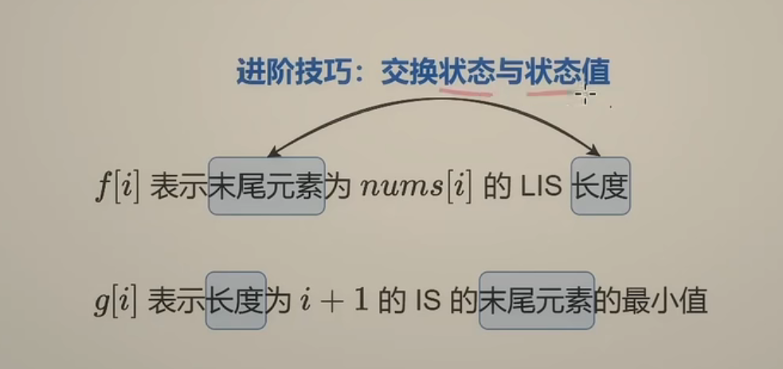
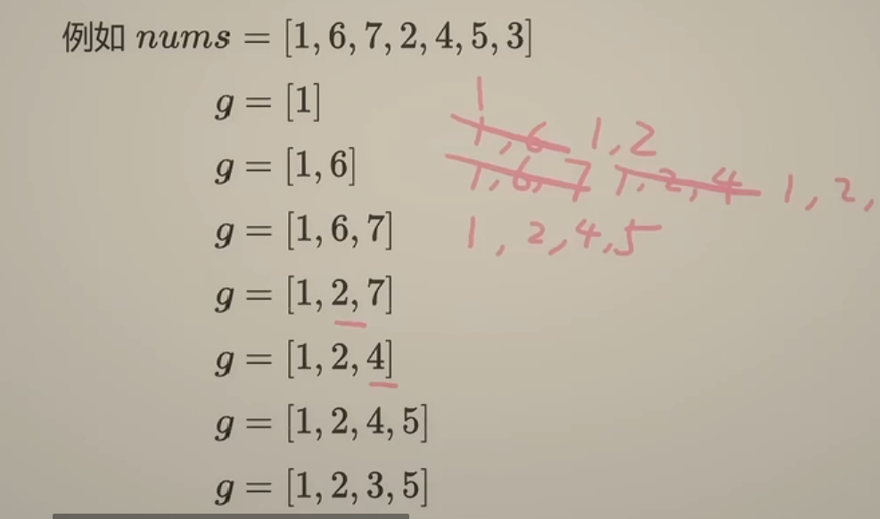

# 最长递增子序列

[300. 最长递增子序列 - 力扣（Leetcode）](https://leetcode.cn/problems/longest-increasing-subsequence/)

> 给你一个整数数组 `nums` ，找到其中最长严格递增子序列的长度。
>
> **子序列** 是由数组派生而来的序列，删除（或不删除）数组中的元素而不改变其余元素的顺序。例如，`[3,6,2,7]` 是数组 `[0,3,1,6,2,2,7]` 的子序列。
>
> ```
> 输入：nums = [10,9,2,5,3,7,101,18]
> 输出：4
> 解释：最长递增子序列是 [2,3,7,101]，因此长度为 4 。
> ```

时间复杂度:O(n*2)

空间复杂度:O(n)

```python
class Solution:
    def lengthOfLIS(self, nums: List[int]) -> int:
        n = len(nums)
        dp = [0] * n
        for i in range(n):
            dp[i] = 1
            for j in range(i):
                if nums[j] < nums[i]:
                    dp[i] = max(dp[i],dp[j]+1)
        return max(dp)
```

优化时间复杂度：贪心 + 二分





```python
class Solution:
    def lengthOfLIS(self, nums: List[int]) -> int:
        n = len(nums)
        g = []
        for x in nums:
            j = bisect_left(g,x)
            if j == len(g):
                g.append(x)
            else:
                g[j] = x
        return len(g)
```

时间复杂度:O(n*logn)

> bisect.bisect和bisect.bisect_right返回大于x的第一个下标(相当于C++中的upper_bound)，bisect.bisect_left返回大于等于x的第一个下标(相当于C++中的lower_bound)。

# 类似题目

最长递增子序列的个数：https://leetcode.cn/problems/number-of-longest-increasing-subsequence/

> 给定一个未排序的整数数组 `nums` ， *返回最长递增子序列的个数* 。
>
> **注意** 这个数列必须是 **严格** 递增的。

> 思路：
>
> 对于最长递增子序列的状态转移f[i] 如下:
>
> 1. 由于每个数都能独自一个成为子序列，因此起始必然有 f[i]=1
> 2. 枚举区间[0,i) ，对于所有数nums[j] :  if nums[j] < nums[i]，表示nums[i] 可以接在nums[j] 后面形成一个更长的递增子序列
> 3. 此时使用f[j] 更新 f[i] 即 f[i] = f[j] + 1
>
> 此题再定义一个cnt[i]，表示**以 nums[i]结尾的最长上升子序列的个数。**
>
> 1. cnt[i] 的转移：同理，由于每个数都能独自一个成为子序列，因此起始必然有 cnt[i]=1
> 2. 枚举区间[0,i) ，对于所有数nums[j] :  if nums[j] < nums[i]，表示nums[i] 可以接在nums[j] 后面形成一个更长的递增子序列,此时需要比较f[i] 和 f[j+1] 的大小关系
> 3. if f[i] < f[j] + 1 即 f[i] 此时会被f[j] 更新，此时以nums[i] 结尾的最长上升子序列的个数就等于以nums[j]  结尾的，即cnt[i] = cnt[j]
> 4. if f[i] == f[j+1] 说明找到了一个新的符合条件的前驱，此时将值继续累加到方案数当中，即有cnt[i] += cnt[j]

在转移过程，我们可以同时记录全局最长上升子序列的最大长度 max_len，最终答案为所有满足 f[i]=max_len的 cnt[i]累加

```python
class Solution:
    def findNumberOfLIS(self, nums: List[int]) -> int:
        n = len(nums)
        dp = [0] * n
        #定义cnt[i] 表示以 i 为结尾的lis个数
        cnt = [0] * n
        max_len = 0
        ans = 0
        for i in range(n):
            dp[i] = 1
            cnt[i] = 1
            for j in range(i):
                if nums[i] > nums[j]:
                    if dp[j] + 1 > dp[i]:
                        dp[i] = dp[j] + 1
                        cnt[i] = cnt[j]
                    elif dp[j] + 1 == dp[i]:
                        cnt[i] += cnt[j]
            if dp[i] > max_len:
                max_len = dp[i]
                ans = cnt[i]
            elif dp[i] == max_len:
                ans+=cnt[i]
        return ans
```

